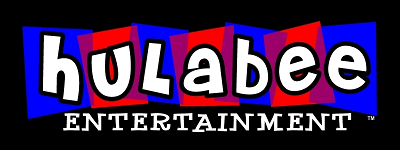

# Hulabee Entertainment Tools



Hulabee Entertainment developed a proprietary engine for its adventure kid games.

The internal name was probably 'Sauce' as referenced in the executable.

```
$ strings MoopTreasure.exe | grep -i engine
ESauce Engine Error: %s
name="Hulabee.ESauce.Engine"
```

This repository contains:

* a rewrite of the engine using SDL2
* a version of [whisk.dll](https://www.dropbox.com/s/pey60eh8rnqftnm/whisk.dll?dl=0) to enable VM opcodes tracing
* scripts to extract and convert assets from `.pan` and `.gg` files

The `pan_decoder` has been tested with the following games:

* [Sonny's Race for Chocolatey Taste](http://www.mobygames.com/game/sonnys-race-for-chocolatey-taste)
* [Moop and Dreadly in the Treasure on Bing Bong Island](http://www.mobygames.com/game/moop-and-dreadly-in-the-treasure-on-bing-bong-island)
* [Ollo in the Sunny Valley Fair](http://www.mobygames.com/game/ollo-in-the-sunny-valley-fair)
* [Mike's Monstrous Adventure](http://www.mobygames.com/game/mikes-monstrous-adventure)
* [Piglet's Big Game](http://www.mobygames.com/game/piglets-big-game)
* [Mah Jong Jr.](http://www.mobygames.com/game/mah-jong-jr)
* Flip Out Jr
* Touchdown Madness
* Casper's Spooky Swap
* Little Mermaid Bubble Blast
* Stitch's Blazing Lasers
* The Lion King Grubalicious
* Realms of Gold
* [Word Spiral](https://www.mobygames.com/game/182441/word-spiral/)

Usage
```
$ ./decode_pan.py MoopData/*pan
name:mooptreasure
size:17634930 count:220 version:5
bytecode:AdventureGame.sob
bytecode:AdventureSFC.sob
bytecode:AutoPlay.sob
```
