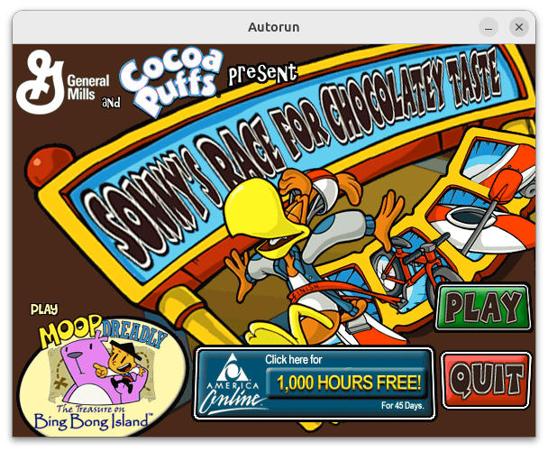

# Information on Hulabee Entertainment Sauce Engine

- [Background](#background)
- [Games List](#games-list)
- [Sauce Language](#sauce-language)
- [Original Interpreter Command Line Options](#original-interpreter-command-line-options)
- [Original ini Settings](#original-ini-settings)


## Background

SCUMM started as an adventure game engine. It was created and used at [Lucasarts](https://www.mobygames.com/company/72/lucasfilm-games/) and later on at [Humongous](https://www.mobygames.com/company/960/humongous-entertainment-inc/) where its scope extend to handle other type of games.

As the scope extended, the engine was modified to support networking, sprites, native code (u32) etc.

When [Hulabee](https://www.mobygames.com/company/5605/hulabee-entertainment-inc/) was founded, based on this [reddit comment](https://www.reddit.com/r/gamedev/s/duwwYmYg59), it looks like SCUMM was not an option. The team then created a new engine.

This new engine is more generic. The interpreter it still executing cooperative threads interpreting bytecode, but all of the game type framework is defined in bytecode.

The SCUMM interpreter has code to deal with [Actors](https://github.com/scummvm/scummvm/blob/ababc83fb15e5224ce674b727ee68196c5f374b7/engines/scumm/actor.cpp), [Rooms](https://github.com/scummvm/scummvm/blob/ababc83fb15e5224ce674b727ee68196c5f374b7/engines/scumm/room.cpp) etc. with SAUCE, all of the game framework is written in the target language and compiled (AdventureSFC.sob).


## Games List

From [Hulabee Entertainment](https://www.mobygames.com/company/5605/hulabee-entertainment-inc/):

* [Sonny's Race for Chocolatey Taste](http://www.mobygames.com/game/sonnys-race-for-chocolatey-taste)
* [Moop and Dreadly in the Treasure on Bing Bong Island](http://www.mobygames.com/game/moop-and-dreadly-in-the-treasure-on-bing-bong-island)
* [Ollo in the Sunny Valley Fair](http://www.mobygames.com/game/ollo-in-the-sunny-valley-fair)
* [Mike's Monstrous Adventure](http://www.mobygames.com/game/mikes-monstrous-adventure)
* [Piglet's Big Game](http://www.mobygames.com/game/piglets-big-game)
* [Mah Jong Jr.](http://www.mobygames.com/game/mah-jong-jr)
* Flip Out Jr
* [Disney's Treasure Planet Collection](https://www.mobygames.com/game/54229/disneys-treasure-planet-collection/)
* Touchdown Madness
* Casper's Spooky Swap
* Little Mermaid Bubble Blast
* Stitch's Blazing Lasers
* The Lion King Grubalicious

From [Beep Games](https://www.mobygames.com/company/4200/beep-games-inc/):

* Four Houses
* [Word Spiral](https://www.mobygames.com/game/182441/word-spiral/)
* Realms of Gold


## Sauce Language

Some games shipped with their source code (or a subset) in their data files. This was likely done to help debugging as the original interpreters include a built-in debugger.

Below is extracted from `Autorun`:



```
class Autorun {
  static Cursor s_cursorArrow
  static Cursor s_cursorPoint

  static script boot() {
    import CoreSFC
    import AdventureSFC

    s_cursorArrow  = new Cursor(ANIM_CURSORS, 1, 1, 0, 0)
    s_cursorPoint = new Cursor(ANIM_CURSORS, 1, 2, 0, 4)

    Room:setCursors(s_cursorArrow, s_cursorPoint)

    if (stoi(System:readINI("$system\\hulabee.ini", "SonnyRace", "Runned", "0")) == 0) {
      System:writeINI("$system\\hulabee.ini", "SonnyRace", "Runned", "1")
      Room:newRoom(AOLScreen)
    } else {
      Room:newRoom(MainScreen)
    }
  }
}

class MainScreen from Room {
  //{{POLYGONS
  #define POLY_PLAYSONNYRACE [100,0,580,300]
  #define POLY_INSTALLAOL [200,330,450,426]
  #define POLY_INSTALLMOOPTREASURE [0,275,182,434]
  #define POLY_EXIT [480,350,550,400]
  //}}POLYGONS

  void onCreate() {
    //{{INITCLICKPOINTS
    INITBACKGROUND(BG_MAINSCREEN)
    INITCLICKPOINT(InstallAOL,ANIM_AUTORUN,4,0,0,POLY_INSTALLAOL)
    INITCLICKPOINT(InstallMoopTreasure,ANIM_AUTORUN,2,0,0,POLY_INSTALLMOOPTREASURE)
    INITCLICKPOINT(Exit,ANIM_AUTORUN,5,0,0,POLY_EXIT)
    INITCLICKPOINT(PlaySonnyRace,ANIM_AUTORUN,6,0,0,POLY_PLAYSONNYRACE)
    //}}INITCLICKPOINTS

    from.onCreate()
  }
}

class PlaySonnyRace from ClickPoint {
  void onClick(int x, int y) {
    if (Autorun:checkSystem()) {
      System:spawn("SonnyRace.exe")
      quit
    }
  }
}

class InstallAOL from ClickPoint {
  void onClick(int x, int y) {
    string command = "AOL\\SETUP.EXE"
    if (FileIO:exists(command)) {
      System:spawn(command)
      quit
    }
  }
}

class InstallMoopTreasure from ClickPoint {
  int install

  void onEnter() {
    if (System:readINI("$system\\hulabee.ini", "MoopTreasure", "Installed", "0") $== "1") {
      string command = System:readINI("$system\\hulabee.ini", "MoopTreasure", "Start", "")
      if (FileIO:exists(command)) {
        install = false
        play(2)
      } else {
        install = true
        play(3)
      }
    } else {
      install = true
      play(3)
    }
  }

  void onClick(int x, int y) {
    if (Autorun:checkSystem()) {
      string command
      if (install) {
        command = "\"MoopTreasure Setup\""
      } else {
        command = System:readINI("$system\\hulabee.ini", "MoopTreasure", "Start", "")
        string path[] = FileIO:splitPath(command)
        if (path[?1] && path[?2]) {
          System:chdir(path[1] + path[2])
        }
      }
      System:spawn(command)
      quit
    }
  }
}

class Exit from ClickPoint {
  void onClick(int x, int y) {
    quit
  }
}
```


## Original Interpreter Command Line Options

Parameter | Comment
---|---
`-a` | Ignore import path
`-b` | Enable breakpoints
`-d` | Enable debugger
`-f` | Fullscreen display
`-i` | Import path for .pan files
`-n` | Disable Sound
`-p` | 
`-w` | Windowed display


## Original ini Settings

Section | Name | Value | Source (Game code/Interpreter) | Comment
---|---|---|---|---
Data | HeapSize | Integer | Game code/Interpreter |
Data | PreloadSpeed | Integer | Interpreter |
Debug | CAssert | Boolean | Interpreter |
Debug | Debugger | Boolean | Interpreter |
Debug | DebugVC | Boolean | Intepreter |
Debug | DebugOutputWindow | Boolean | Interpreter |
Debug | EnableCheatKeys | Integer | Game code | Set to 100801 to enable
Debug | Keys | Boolean | Interpreter |
Debug | LoadDelay | Integer | Interpreter |
Debug | PerformanceData | Boolean | Interpreter |
Debug | ShowBlitRegions | Boolean | Interpreter |
Debug | ShowFrameNumber | Boolean | Interpreter |
Debug | ShowLoads | Boolean | Interpreter |
Debug | whisk | Boolean | Interpreter |
General | Audio | Boolean | Game code |
General | ClosedCaptioning | Boolean | Game code |
General | DisableSoundSystem | Boolean | Interpreter |
General | Dither | Boolean | Interpreter |
General | DitheredShadows | Boolean | Game code |
General | ForceWaveout | Boolean | Interpreter |
General | LanguageDialog | Integer | Game code | 100000 for English
General | LanguageText | Integer | Game code | 100000 for English
General | MasterVolume | Integer | Game code |
General | Music | Integer | Game code |
General | MusicOff | Integer | Game code |
General | MusicVolume | Integer | Game code |
General | SoundBitRate | Integer | Interpreter |
General | SoundChannels | Integer | Interpreter |
General | SoundOutputRate | Integer | Interpreter |
General | Tick | Integer | Game code |
Video | Center | Boolean | Interpreter |
Video | DisplayXPos | Integer | Interpreter |
Video | DisplayYPos | Integer | Interpreter |
Video | DisplayWidth | Integer | Interpreter |
Video | DisplayHeight | Integer | Interpreter |
Video | Fullscreen | Boolean | Interpreter |
Video | vblank | Boolean | Interpreter |


