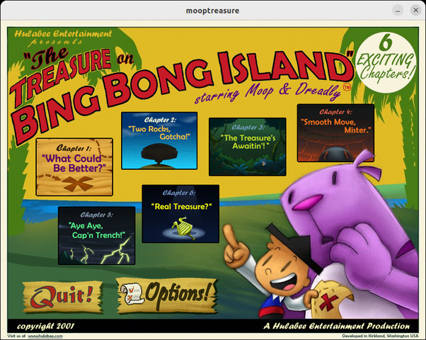

# Sauce VM

Rewrite of the engine used by games developed by [Hulabee Entertainment](https://www.mobygames.com/company/5605/hulabee-entertainment-inc/)



Supported games:

* [Moop and Dreadly in the Treasure on Bing Bong Island](http://www.mobygames.com/game/moop-and-dreadly-in-the-treasure-on-bing-bong-island)
* [Ollo in the Sunny Valley Fair](http://www.mobygames.com/game/ollo-in-the-sunny-valley-fair)

## Running

The original game data files (.pan) are required.

```
./vm --datapath path/to/datafiles
```


## Compiling

The code depends on [libjpeg-turbo](https://www.libjpeg-turbo.org/) and [SDL2](https://libsdl.org/).


## Missing Features

* Captions
* Load/Save
* Sound
* VM GC
